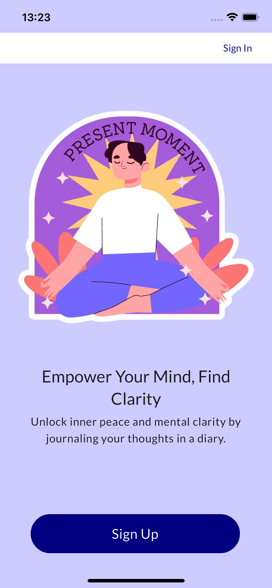
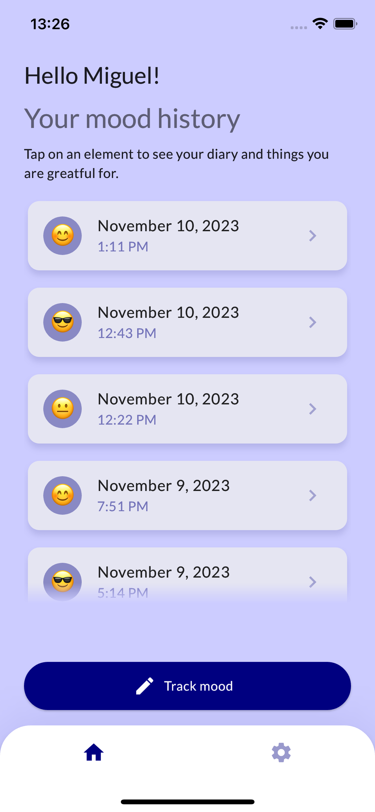
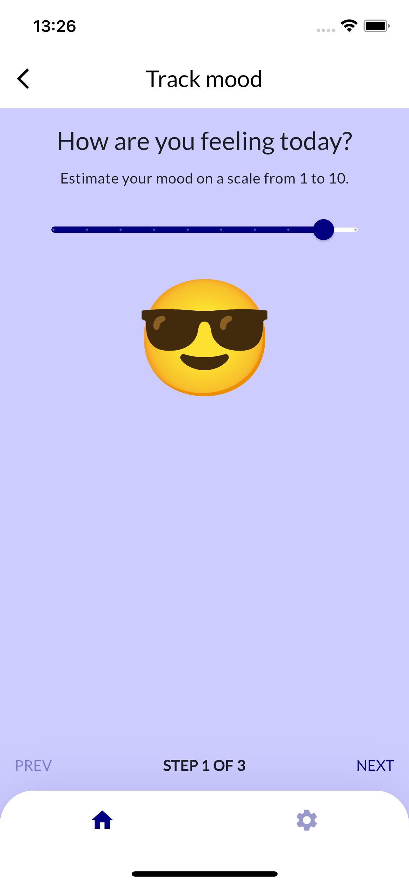

# Mood tracking app

## App

The Flutter app (currently supporting Android and iOS) provides tracking mood consisting of a method that helped me a lot with freeing my mind from negativity and getting more clarity.
It includes estimating your current mood, affirmations by writing down things you're greatful about and a diary to write about thoughts keeping your mind busy.

Project's long term goal is not only to offer tracking mood, but to offer tools analysing it in order to prevent mental issues like depressions.

## Short term goals

- [ ] Clean up the codebase
- [ ] Release for Android
- [ ] Release for iOS

## Contribution

I appreciate your commitment a lot. Feel free to open PRs for small improvements and bugs. If you would like to add a bigger change than e.g. a bugfix to the app, please open an issue first so we can take care about it together and find the best solution before starting to work on it.
