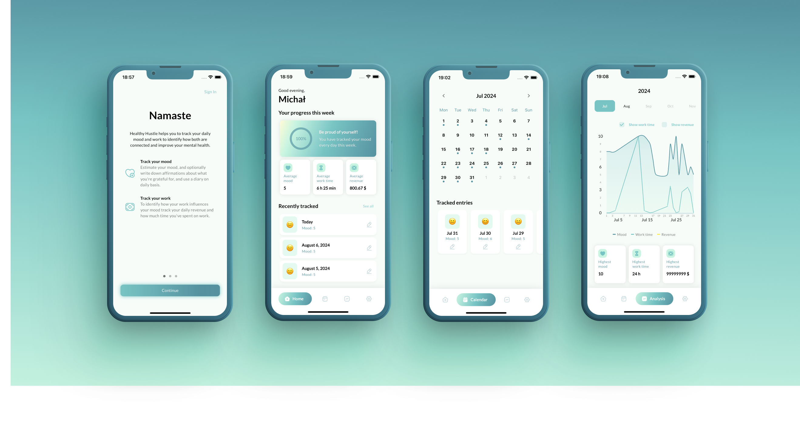

# Healthy Hustle

 

## 📱 App

The app provides estimating your current mood, affirmations by writing down things you're grateful about and a diary to write about thoughts keeping your mind busy.
Additionally users are able to track their daily revenue and working hours so they are able to evaluate data to identify how the tracked factors are connected with each other.

The long-term vision is to offer tracking other things besides work related factors that may be connected to users' mood e.g. sport sessions, selfcare time, etc. which all can be tracked personally so users who want to track additionally things not related to their work are able to identify connections betweed tracked factors and their mood based on their personal demands.

## 🎯 Short term goals

[Kanban board](https://github.com/users/krolmic/projects/2)

## 🧑‍🏭 Contribution

I appreciate your commitment a lot. Feel free to open PRs applying small improvements, or fixing bugs. If you would like to add a bigger change than e.g. a bugfix to the app, please open an issue first so we can take care about it together and find the best solution before starting to work on it.

Please follow [the semantic commit messages guideline](https://gist.github.com/joshbuchea/6f47e86d2510bce28f8e7f42ae84c716).
